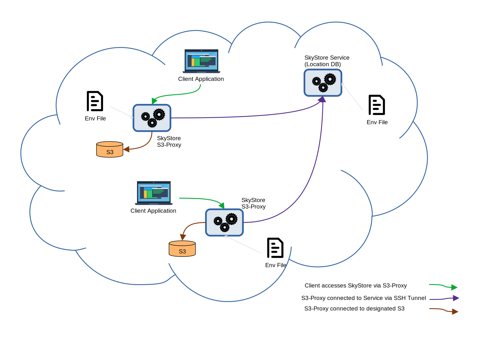
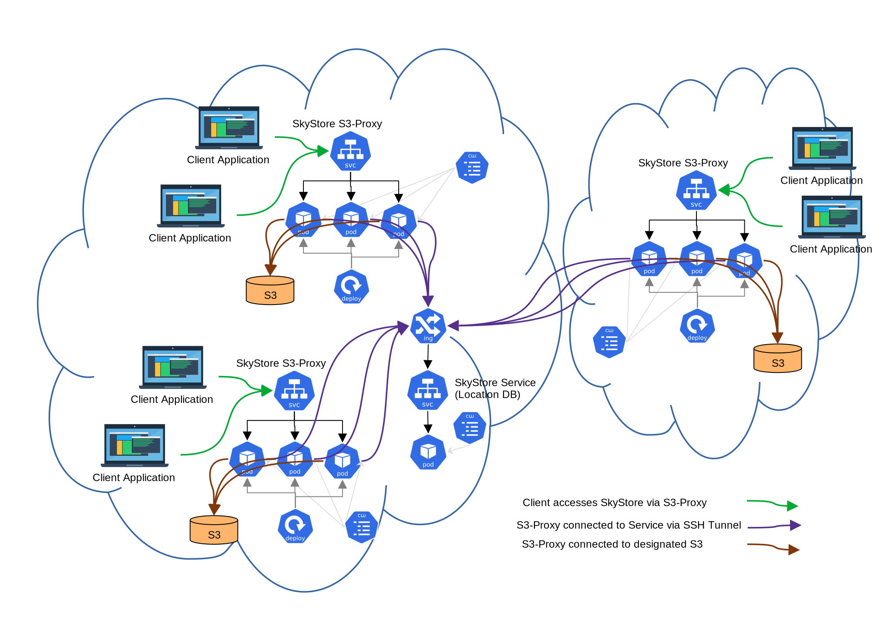

# Deploying SkyStore in Docker or in Kubernetes

## Overview
SkyStore can be deployed in containerized form, using either Docker or Kubernetes. In eithee case, there are two types of components: the SkyStore metadata server (location DB) and the SkyStore S3-Proxy, which facilitates client usage of SkyStore. Each of these is created as as one or more containers from a common base image, and the added plumbing revolves around connectivity and configuration. 

Notes:
1. *Security*: SkyStore communication is currently plaintext HTTP. To harden the internal communication between S3-Proxy and the central server, we wrap it in an SSH tunnel (so S3-Proxy connects to SSH port of server IP). As for S3-proxy communication to client, it is standard S3 protocol, which has built-in support for TLS hardening, and this will be a next step.
2. *Configuration*: while the central metadata server of SkyStore has relatively simple and fixed configuration, each S3-proxy can be configured differently in terms of which S3 to connect to, policy to employ etc. Because of that, the deployment process and tooling inherently support different configurations, as detailed below.

### SkyStore in Docker
The Docker deployment of SkyStore is basically a proof-of-concept of containerized deployment. It is not intended for future production use. There is no support for multi-cluster or scaling os S3-proxy.It is a simple 1-node cluster (e.g., your laptop) for experimenting with and debugging SkyStore in container form. In this setup, we deploy one container of SkyStore (metadata / location DB) server, and one or more containers of S3-proxy, each configured separately using Docker env files. Clients connect to service exported from S3-proxy containers. See the diagram below.
 

### SkyStore in Kubernetes
This form of deployment is intended for future production use of SkyStore. It uses the same container images and configuration env files that should be prepared for SkyStore in Docker deployment. However, deploying in Kubernetes already supports scaling of S3-proxy for handling scalability, as well as deploying across multiple Kubernetes clusters. The SkyStore (metadata / location DB) server is deployed as a Service in one cluster and obtains an IP address that is accessible to all clusters (e.g., using Ingress / LoadBalancer / NodePort). For now, this service is not scalable as it relies on a single pod. All S3-proxies are deployed as scalable services whose pods connect to the server pod. The scheme below desribes one possible deployment of multiple S3-proxy services connected to a SkyStore service, 2 in the same premise (cloud region / VPC / cluster) and one in a different premise. 


## How to deploy
Please follow the sub-sections in order, but according to your goal. Even if you intend you deploy on Kubernees, you still need to have the container images and env files.

### 1. Get the container images
Before deploying containers (either Docker or K8s) you need to have the container images. There are 3 images: 
* `skystore-base` - is the common base layer with full skystore installation
* `skystore-server` - is the skystore metadata server
* `skystore-s3proxy` - is the skystore s3-proxy that facilitates S3 access to clients

If you don't have those images (locally or in a remote registry), then you need to prepare them locally first using `docker`. You should clone the skystore repo, `cd` to the repo root, and proceed with the commands below
```bash
cd docker/build
./build_all.sh
```
This should create the images locally in your machine. You should see the images by running `docker images`.

If all you want is to test SkyStore in containers locally using `docker` (see below), then having the images locally is enough. If you want to deploy in one or more remote clusters and/or use K8s, then you also need to push the images to a registry that is accessible to all your deployment locations. For example, you can use docker.io, quay.io, or custom docker registries.
To push the images to a given registry, you need to tag them first by adding the registry's prefix and then push. Assuming your current folder is repo root and that you have logged in with `docker` to your account in the registry, run the following commands:
```bash
cd docker/build
./tag_all.sh <registry prefix>
./push_all.sh <registry prefix>
```
Replace `<registry prefix>` with the prefix required for the target registry.

### 2. Prepare Env Files
When running SkyStore containers, there are several configuration arguments that need to be passed to either the metadata server or each s3-proxy server. Those arguments are first created as Docker env files, which can be readily used for deploying containers using Docker. If using K8s, env files can be further converted to Config Maps or Secrets.

#### 2.1 Create SSH Keypair
To prepare env files for a new deployment of SkyStore, you first need to create the keypair that secures the SSH tunnel between the metadata server and the s3-proxy servers. Starting from the repo root, do the following commands:
```bash
cd docker/run
./genkeys.sh
```
This creates a sub-folder `docker/run/keys` that contains the keypair. The public key is going to be stored in the metadata server and the private key is going to be stored in each s3-proxy server, so that the keys can be used to create an SSH tunnel from the s3-proxy server to the metadata server.

#### 2.2 Create Server Env File 
Next, you should create the env file for the metadata server. The env file is created in a sub-folder under `docker/run` that will contain all the necessary configuration. A good name for this sub-folder can be the chosen name of your new SkyStore deployment with suffix `-server`, e.g. `myskystore-server`. After you select the deployment name, do the following starting at the repo root:
```bash
cd docker/run
mkdir <my deployment name>-server
cd <my deployment name>-server
ln -s ../keys .
```
Next, you add the base environment file for the server in the folder, in a file called `env.base`. This file should contain the environment variables required for the SkyStore metadata server, such as `INIT_REGIONS` and `SKYSTORE_PREFIX`. You will find a file called `/docker/run/env.server.example` that you can copy into `env.base` in your folder and customize to your needs.

Now that all the configuration is in the folder, you can create the environment file by running the following command *inside* your server sub-folder:
```bash
../add_server_all.sh
```
The resulting environment file for the server is called `env.final` in the same sub-folder that you created.

#### 2.3 Create S3-Proxy Env File(s)
Next, you need to create one env file for each s3-proxy server that uses a *different* configuration, such as different S3 backend or different S3-proxy policy. *Good practice:* if you're deploying multiple configurations, prepare a unique suffix (with no white space) for each one, e.g., `-cloud-eu`, `-edge-read-only`, or simply `-3`. 

Similar to the server env file, each s3-proxy env file is created in a separate sub-folder of `docker/run`. In accordance with the server env file, a good name for this folder should be the SkyStore deployment name, followed by `-s3proxy` and then followed by the suffix that you prepared for that configuration, e.g.,  `myskystore-s3proxy-cloud-eu`. Thus, you run the following (starting from repo root):
```bash
cd docker/run
mkdir <my deployment name>-s3proxy-<config name>
cd <my deployment name>-s3proxy-<config name>
ln -s ../keys .
```
Next, you add the base environment file for the s3-proxy in the folder, in a file called `env.base`. This file should contain the environment variables required for the SkyStore s3-proxy server, specifically the following:
* `SKYSTORE_SRV_ADDR` - the IP address of the SkyStore metadata server. This allows the s3-proxy to communicate with the server. If you don't know this before deployment, just put some dummy value here, e.g., `127.0.0.1` and update the final env file (see below) after the metadata server is deployed.
* `SKY_ACCESS_KEY_ID` and `SKY_SECRET_ACCESS_KEY` - these are the credentials for accessing s3-proxy as a standard S3 service, and they are named so to be separate from the original `AWS_*` credentials that may be used by s3-proxy to access its S3 backend.  
You will find a file called `/docker/run/env.s3proxy.example` that you can copy into `env.base` in your folder and customize to your needs.

Next, you need to add the S3 backend configuration in the folder, in a file called `aws.config`. This is exactly the standard format of AWS configuration file, with just one `default` profile. There is an example file `docker/run/aws.config.example` that you can customize.

Last, you need to add the SkyStore S3-proxy configuration JSON file in the folder, in a file called `s3proxy.json`. This is the same JSON file that is needed for configuring s3-proxy in the basic process deployment, with one extra line of `server_addr` that should always be set to `127.0.0.1`. You will find a file called `docker/run/s3proxy.json.example` that you can copy into `s3proxy.json` in your folder and customize to your needs.

Now that all the configuration is in the folder, you can create the environment file by running the following command *inside* your server sub-folder:
```bash
../add_s3proxy_all.sh
```
The resulting environment file for the s3-proxy is called `env.final` in the same sub-folder that you created.

Important:
* You need to repeat the s3proxy env file creation for each different S3-Proxy configuration, depending on your application.
* For Docker and other dynamic setups where the IP address of the metadata server is not known before deployment, you need to update the `SKYSTORE_SRV_ADDRR` in the `env.final` file of all s3-proxy configurations of your SkyStore deployment after the metadata server is deployed and assigned an IP address.

### 2.4 Plan & Execute a SkyStore Deployment
Now that you have your images and env files, you need to plan your deployment. You can have a single SkyStore deployment in one cluster (Docker) or across one or more clusters (K8s). In each cluster, you can have one or multiple s3-proxy configurations. The only limitations you should consider are:
* The metadata server is deployed only once, but needs to be reached by all S3-proxy. Thus, if you're using multiple clusters, make sure the metadata server's IP address and SSH port are accessible to all clusters.
* Basic Docker does not allow horizontal scaling containers. Hence, horizontal scaling of s3-proxy is enabled only in K8s. For now, there is manual scaling using K8s Deployment, but we plan to add auto-scaling and/or side-cars in the future.

Next, we discuss two main deployment options: In Section 3, a Docker deployment in a single cluster. In Section 4, a K8s deployment (single or multiple clusters). Choose one of the options and proceed. 
 
### 3. Docker Deployment
To deploy SkyStore on Docker you need to do the following:
1. If the container images are available in a remote registry, make sure your `docker` tool is logged in to the remote registry.
2. Run these commands (from repo root) to launch the metadata server in a container:
```bash
cd docker/run
./run_skystore_server_docker.sh <path to env file> <registry prefix>
```
Where:
    * `<path to env file>` is the full path to the `env.final` file your created earlier for the metadata server 
    * `<registry prefix>` is the prefix for the remote registry, or ommitted if the images are created locally
3. Use `docker ps` to locate the metadata server (`skystore-server`) container UUID
4. Use `docker inspect` on your metadata server container UUID and find the IP address of the container.
5. Update the `SKYSTORE_SRV_ADDR` of all `env.final` env files of s3-proxy of this SkyStore deployment with the IP address of the metadata server
6. Run these commands (from the repo root) to lanuch s3-proxy containers:
```bash
cd docker/run
```
Then, for each s3-proxy instance you wish to run, do:
```bash
./run_skystore_s3proxy_docker.sh <path to env file> <registry prefix>
```
Where `<path to env file>` points to the `env.final` of the selected s3-proxy configuration and `<registry prefix>` is as above.

#### 3.1 Testing & Using Docker Deployment
1. Use `docker logs` on the metadata server container UUID to make sure the server was properly started - the log output should be similar to the process exeucution, telling that the server has started and listening on port 3000
2. Use `docker ps` and `docker logs` to locate each S3-proxy container UUID (`skystore-s3proxy`) and to see that it did not fail to connect (via SSH tunnel) to the metadata server and then start itself, listening on port 8002
3. A Linux host connected to the container network (172.X.X.X) can be used to test each S3-proxy using e.g. AWS CLI, and configuring a profile in `~/.aws/config` such as the following:
```
[profile s3proxy]
aws_access_key_id=<SKY_ACCESS_KEY_ID>
aws_secret_access_key=<SKY_SECRET_ACCESS_KEY>
endpoint_url=http://<s3proxy container ip>:8002
verify_ssl = False
```
Where:
    * `<SKY_ACCESS_KEY_ID>` and `<SKY_SECRET_ACCESS_KEY>` are the values of the respective variables configured in the S3-proxy env file
    * `<s3proxy container ip>` is the IP address of the container of the select S3-proxy, obtained e.g., through `docker inspect` on the container UUID.
*Note* For now, S3-proxy does not support SSL encryption directly, hence the need for `verify_ssl = False` in the profile. We plan to fix it or work around it soon.
Once the above profile is set up, AWS CLI commands can be used to test SkyStore e.g.,:
```bash
aws s3api --profile s3proxy <AWS S3 commands: create-bucket, list-buckets, put-object, etc..>
```
  
Container applications in the Docker cluster can now begin to use SkyStore by connecting to specific S3-proxy with AWS S3 profile configurations in the client containers similar to the previous step. 


### 4. Kubernetes Deployment
To deploy SkyStore in K8s, make sure of the following:
1. The SkyStore images must be stored in a container registry that your clusters can access. Credentials for the container registry (if needed) can be in a K8s Secret (e.g., `regcred`) or configured in a K8s ServiceAccount. 
2. All the contexts of the clusters you wish to use in this deployment should be available on the machine you are deploying from.
3. Choose a namespace to be used for deploying SkyStore in each K8scluster. Preferrably, it should be the same namespace in all clusters.

#### 4.1 Select Type of Deployment
Currently, there are 2 supported types of deployments, named by the respective sub-folder of `k8s/run` of repo root. Choose which type you want to deploy:
1. `pods-cm` - this is the basic deployment, limited to a single cluster. The metadata server and S3-proxies are implemented each as a single pod, each with its own config map (CM). No scaling of S3-Proxy.
2. `svc-dep-cm` - this is the more advanced deployment, for a single cluster or for multiple clusters. The metadata server is a K8s Service, so it can be made visible outside the cluster (i.e., accessible to other clusters). Additionally, each S3-Proxy is a K8s Service on a K8s Deployment. Thus, it has a fixed internal IP address for access that is load-balanced across multiple pods. Also, it can be scaled out or in (manually, for now) and restarted in case of failure. It can also be externalized just like the metadata server, but that's not really an expected use (since client applications are likely be pods in the same cluster as well).

#### 4.2 Prepare YAMLs
After you've selected the appropriate type of K8s deployment, `cd` into its matching sub-folder of `k8s/run` from repo root. There you will find 2 YAML example files (`server` and `s3proxy`) that you need to copy and customize into your concrete YAMLs, as following.
1. `server.yaml.example` - This is the metadata server deployment YAML. First, copy it into a concrete YAML, e.g., `cp server.yaml.example server.yaml`. Then, open `server.yaml` with a text editor and modify the following:
    * Change the `namespace:` values to the namespace name that you chose for this deployment
    * Change the `image:` line to the correct image name with the contaier registry prefix
    * There are lines that handle container registry credentials. These are either `imagePullSecrets:` line followed by `- name:` in the next line, or `serviceAccountName:` followed by the Service Account name in the same line. If your container registry does not require crednetials, remove those lines. If you have crednetials in either a Secret or SA, then change to the approriate form.
    * If you're using the advanced deployment, you need to choose if and how you externalize your metadata service to other clusters. This is defined in the `type:` line of the bottom part of the YAML (which defines the Service). If you're using a single cluster, then you should choose type `CluserIP` and optionally select the internal IP address of the service. For multiple clusters, you need to select the proper external visibility option, such as `LoadBalancer` or `NodePort`, depending on what choices you have in your clusters, with optional external IP defined as well. See [here](https://kubernetes.io/docs/concepts/services-networking/service/#type-clusterip) for details.
2. `s3proxy.yaml.example` - This is the S3-proxy deployment YAML. You need to copy it to one or more concrete YAML files, depending on how many different configurations of S3-proxy you wish to deploy. This configuration's suffix (that you prepared with the Docker env files) should be added to each copy of the file, e.g., `cp s3proxy.yaml.example s3proxy-3.yaml`. Then, edit each copy and customize with a text editor as following:
    * Change the `namespace:` values to the namespace name that you chose for this deployment
    * Change the `image:` line to the correct image name with the contaier registry prefix
    * There are lines that handle container registry credentials. These are either `imagePullSecrets:` line followed by `- name:` in the next line, or `serviceAccountName:` followed by the Service Account name in the same line. If your container registry does not require crednetials, remove those lines. If you have crednetials in either a Secret or SA, then change to the approriate form.
    * There are several lines that have the field `name:` or a field that ends with `name:`. In all those lines (except the optional container registry credentials name), if you have more than one configuration, change the corresponding name value as following: after the word `s3proxy`, insert the unique suffix of that specific configuration. Thus, a line like `name: s3proxy-port` would change to `name: s3proxy-3-port`, and a line like `app.kubernetes.io/name: skystore-s3proxy` would change to `app.kubernetes.io/name: skystore-s3proxy-3`.  

#### 4.3 Create Config Maps and Deploy
Configuring the SkyStore containers is currently supported via K8s Config Maps (CMs). Those CMs are created from the Docker env files that you prepared earlier. As a good practice, each CM pertaining to a given server/s3proxy needs to be created prior to the actual server/s3proxy being launched, so that the launched pods should not be pending. 
1. Create the server CM and launch the server. Make sure your `kubectl` tool is connected to the cluster where you need to deploy the metadata server, and that the current namespace is the one chosen for SkyStore deployment. Now run the following (from repo root):
```bash
cd k8s/build
./mk_server_cm.sh <path to env file>
```
Where `<path to env file>` is the full path to the `env.final` file of the metadata server that was prepared earlier. 
Next, launch the metadata server in the same cluster. Run the following:
```bash
cd k8s/run/<type of deployment>
kubectl apply -f server.yaml
```
Where `<type of deployment>` is sub-folder matching the type of K8s deployment you selected intially.

2. Locate the IP address of the metadata service. It's either known a-priori (because you set it yourself in the server YAML) or it can be discovered by `kubectl describe svc skystore-service`. Make sure that IP is set correctly in all the `env.final` of the S3-proxy configurations.

3. For each cluster you want to deploy SkyStore S3-proxy in, identify the configurations of S3-proxy that you wish to deploy in that cluster. Make sure your `kubectl` tool is connected to that cluster, and that the current namespace is the one chosen for SkyStore deployment.
Now, run the following (from repo root):
```bash
cd k8s/build
```
Next, for each S3-proxy configuration for that cluster, run the following:
```bash
./mk_s3proxy_cm.sh <path to env file> <configuration suffix>
```
Where `<path to env file>` is the full path to `env.final` of the respective oconfiguration and `<configuration suffix>` is the configuration suffix with no leading dash. For example:
```bash
./mk_s3proxy_cm.sh <repo root>/docker/run/myskystore-s3proxy-cloud-eu/env.final cloud-eu
```
Last, launch all the S3-proxy configurations for that cluster. First do (from repo root):
```bash
cd k8s/run/<type of deployment>
```
Where `<type of deployment>` is sub-folder matching the type of K8s deployment you selected initially.
Then, for each S3-proxy configuration for that cluster, do:
```bash 
kubectl apply -f s3proxy-<configuration suffix>.yaml
```

#### 4.4 Testing & Using K8s Deployment
1. Use `kubectl logs` on the metadata server pod to make sure the server was properly started - the log output should be similar to the process exeucution, telling that the server has started and listening on port 3000
2. Use `kubectl get pods` and `kubectl logs` to locate each S3-proxy pod (`skystore-s3proxy`) and to see in its logs that it did not fail to connect (via SSH tunnel) to the metadata server and then start itself, listening on port 8002
3. A Linux host with `kubectl` connected to any of the K8s clusters can be used to test each S3-proxy service using e.g. AWS CLI, and configuring a profile in `~/.aws/config` such as the following:
```
[profile s3proxy]
aws_access_key_id=<SKY_ACCESS_KEY_ID>
aws_secret_access_key=<SKY_SECRET_ACCESS_KEY>
endpoint_url=http://127.0.0.1:8002
verify_ssl = False
```
Where:
    * `<SKY_ACCESS_KEY_ID>` and `<SKY_SECRET_ACCESS_KEY>` are the values of the respective variables configured in the S3-proxy env file
*Note* For now, S3-proxy does not support SSL encryption directly, hence the need for `verify_ssl = False` in the profile. We plan to fix it or work around it soon.
Once the above profile is set up, first open a separate terminal and run there:
```bash
kubectl port-forward svc/s3proxy-service-<configuration suffix> 8002:8002
```
Where `<configuration suffix>` is the configuration suffix for the particular S3-proxy being tested. Then, AWS CLI commands can be used to test that SkyStore S3-proxy e.g.,:
```bash
aws s3api --profile s3proxy <AWS S3 commands: create-bucket, list-buckets, put-object, etc..>
```
  
Container applications in the K8s cluster can now begin to use SkyStore by connecting to specific S3-proxy service's internal IP address (discovered through `kubectl describe svc s3proxy-service-<configuration suffix>`). They should use an AWS S3 profile similar to above except that the IP address in the `endpoint_url` field should be the interanl IP address  of the S3-proxy service in the same cluster. 

# Acknowledgement
The research leading to these results has received funding from the European Union Horizon Europe Programme under the EXTRACT Project, grant agreement n° 101093110